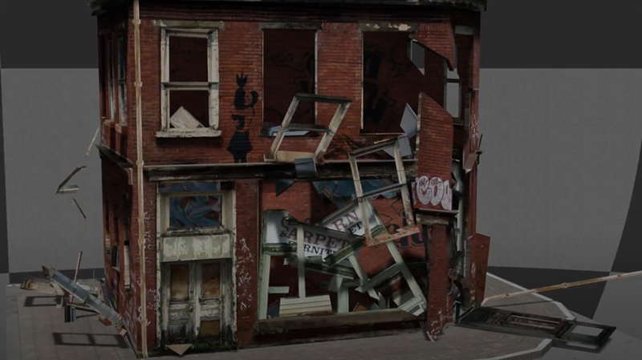
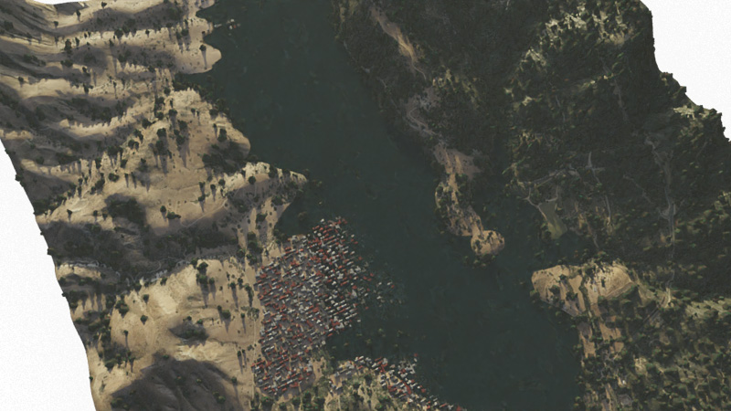

## Kühn András Gábor

**Contact info:**  
**Phone:** \+3630/8526596    
**Email:** [kuhnandrasgabor@gmail.com](mailto:kuhnandrasgabor@gmail.com)  
**Social:** [Facebook](https://www.facebook.com/eyewitness4560) , [LinkedIn](https://www.linkedin.com/in/andrew-k%C3%BChn-58251070/)  
**Visuals:** [Gallery](https://drive.google.com/drive/u/1/folders/17BtC\_NqO1VWdKJ8OTOcvbAuNRcr1uOjr)

# Professional experience

## Summary:

Professional with over a decade of diverse experience spanning photography, 3D visualization, software
development, and machine learning. Track record in leadership roles, including CEO of a tech startup, where I led a
complex project in multiplayer online game development and later as CTO of a startup doing AI powered industrial data management and SaaS solutions. Skilled in business negotiation, project management, and
creative design, with a strong technical background in full-stack development and data science. I excel in multicultural
environments and am adept at leading cross-functional teams. Committed to continuous learning and improvement, with an
eye for detail and a passion for technology and innovation.

## 2020 – Present: Data Science, Machine Learning, Full-Stack Developer & Acting CTO at Pzartech Ltd.

* Initially joined as a freelance developer; currently acting as CTO, overseeing all technical development and architecture.
* Leading the development of web-based data management software and SaaS solutions for ERP systems.
* Responsible for Azure cloud resource deployment, DevOps project management, and CI/CD pipeline implementation.
* Spearheading .NET Blazor Razor pages projects with MAUI multiplatform build targets.
* Collaborating on strategic planning, technical decision-making, and future company growth, including a potential equity stake based on contributions.
* Key contributions include SAP integration prototype, ElasticSearch analytics, Azure storage management, development and implementation of visual search and OCR solutions.

### *Web based data management software*

* SaaS software structure and design consultation for ERP software
* Azure cloud resource deployment and management
* Azure DevOps project management, CI/CD
* .Net Blazor Razor pages based project with MAUI multiplatform build targets
  * Azure bulk storage integration and management
  * API connections between
    * frontend server
    * core server
    * various recognition module servers
  * Image and Character recognition development and integration
  * Responsive UI with MudBlazor
  * ElasticSearch based page and usage analytics prototype
  * Media storage and streaming prototype
  * SAP integration prototype

### *Machine learning and training*

* ML dataset generation
  * Raw video processing, segmentation, enhancement, evaluation for semi-synth data
  * Realistic generation of labelled synthetic images
  * Dataset management and tooling
* ML Training
  * Image quality assessment network for training data evaluation
  * Bounding box generation network for training data evaluation
  * Image classifier network for industrial part recognition
  * Optical character recognition system
* Integrating with existing SaaS architecture in Azure’s cloud
* Performance charting and analysis

## 2011 – Present: Freelance Professional (Photography, 3D Graphics, Web Design, Architectural Visualization)

* Built a versatile freelance career working across photography, 3D visualization, web design, and architectural rendering.
* Worked on interactive, real-time 3D visualization projects using Unreal Engine 4 and Blender for both personal and client projects.
* Developed custom software and visual content for architectural clients, real estate businesses, and various small enterprises.
* Handled marketing, business negotiation, and client relations independently to maintain a diverse client base.

### *Freelance Architectural visualizations*
* Analyzing and interpreting plot schematics and regulations
* Floor Plans accurate to the millimeter
* Custom furniture design
* Interior design
* 3D modeling

#### Interactive Architectural Visualization
* Real-time interactive demo software using Unreal Engine 4
* Hybrid lighting, using both real-time reflections and switchable dynamic lights, with pre-baked lightmaps

#### Realistic Architectural Visualization
* Realistic rendering
* Solar gain analysis 
* Quick and dirty mockup from on-site photos and measurements

#### *3D modelling and visual effects*
* visualizing and rendering various natural disasters
* distributed rendering locally on several machines
* physics simulation including fluids, smoke, collisions, and destruction

