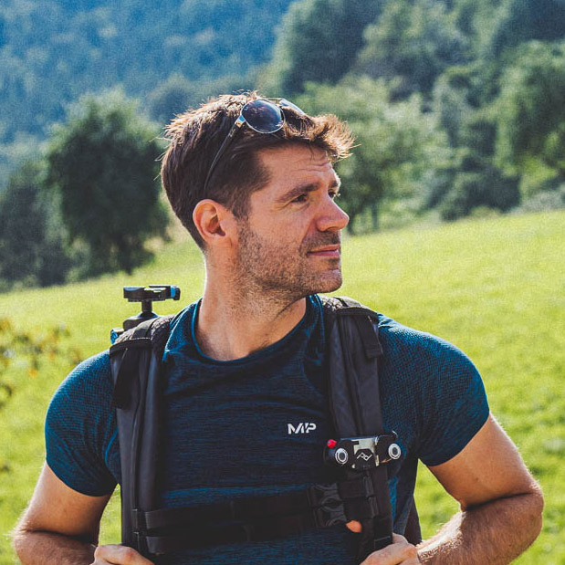

# Kühn András Gábor
### Csak-felsorolás önéletrajz gyors és részletes áttekintéshez

###### _A többit megtekintheti GitHub-on: [http://github.com/kuhnandrasgabor/cv ](http://github.com/kuhnandrasgabor/cv)_
###### _Vagy beszélhet velem / rólam a GPT chatrobotomon keresztül: [https://chatgpt.com/g/g-CwjQO2tT5-curriculum-virtuale](https://chatgpt.com/g/g-CwjQO2tT5-curriculum-virtuale)_

# Személyes információk

 * **Hely:** [Szeged, Hungary](https://maps.app.goo.gl/HrTJQS68Pcr1mWZY9)

 * **Email:** [kuhnandrasgabor@gmail.com](mailto:kuhnandrasgabor@gmail.com)

 * **Social:** [LinkedIn](https://www.linkedin.com/in/andrew-k%C3%BChn-58251070/)

 * **Képekben:** [Galéria](https://drive.google.com/drive/u/1/folders/17BtC\_NqO1VWdKJ8OTOcvbAuNRcr1uOjr)

## Célok

* Hosszú távú karrier egy szenvedélyeimmel összhangban lévő területen
* Világos lehetőségek a növekedésre és előrelépésre
* Munka és magánélet egyensúlya távmunkával vagy rugalmas munkarenddel
* Versenyképes jövedelem
* Részvétel értékes és izgalmas projektekben
* Folyamatos tanulási és szakmai fejlődési lehetőségek
* Autonómia, illetve együttműködés és csapatmunka

# Szakmai tapasztalatok

- Több mint egy évtizedes szakmai tapasztalat különböző területeken:
  - **Gépi tanulás**
  - **Webfejlesztés**
  - **3D vizualizáció**
  - Profi **fotózás**
- Tapasztalat vezetői szerepekben **kisebb csapatokban**, ideértve:
  - Egy technológiai startup vezérigazgatója, amely egy bonyolult **online játékfejlesztési projektet** vezetett
  - Egy startup technológiai vezérigazgatója, amely **AI-alapú adatkezelési** és SaaS megoldásokat nyújt a repülési és nehéziparok számára
- A legjobb a **kreatív tervezésben és problémamegoldásban** vagyok
- Kiválóan teljesítek **multikulturális környezetekben** erős angol nyelvtudásom miatt
- Odafigyelek a részletekre, és érdeklődöm a technológia és az innováció iránt

## 2020 – Jelen: Adattudomány, Gépi Tanulás, Full-Stack Fejlesztő & Technikai vezető Pzartech Ltd.

* Full-stack webfejlesztés .Net Core, Blazor, Razor, MongoDB, MAUI 
* ML/AI fejlesztés Pythonnal
* Képosztályozó és OCR rendszer tanítás és telepítése
* CI/CD Azure DevOps, Azure Portal-al
* Git verziókövetés az Azure DevOps-on keresztül

### Web alapú adatmanagement szoftver

* SaaS szoftver struktúra és design konzultáció ERP szoftverhez 
* Azure felhő erőforrások telepítése és kezelése
* Azure DevOps projektmenedzsment, CI/CD
* .Net Blazor Razor oldalakon alapuló projekt MAUI többplatformos célokkal
  * Azure bucket tároló integráció és kezelése
  * API kapcsolatok
    * frontend szerver
    * core szerver
    * különböző felismerő modul szerverek
  * Kép és karakterfelismerés fejlesztése és integrációja
  * Responsive UI MudBlazorral (bár nem vagyok igazán front-end fejlesztő)
  * ElasticSearch alapú oldal és használati analitika prototípus
  * Média tárolás és streaming prototípus Azure médiaszolgáltatásokkal
  * SAP integrációs prototípus SAP HANA S/4 Product Master Adatokhoz

#### Használt és elsajátított képességek
 * C#, Python, HTML
 * .Net Core, Blazor, Razor, MongoDB, MAUI
 * Azure DevOps, Azure Portal, CI/CD
 * Git verziókövetés az Azure DevOps-on keresztül

### Gépi Tanulás és Adattudomány

* ML adatszett generálás
  * Nyers videó feldolgozás, szegmentálás, javítás, kiértékelés fél-szintetikus adatokhoz
  * Realisztikus címkézett szintetikus képek generálása
  * Adatmanagement és ehhez eszközök létrehozása
* ML tanítás
  * Képminőség-értékelő hálózat a tanítóadatok kiértékeléséhez
  * bounding-box hálózat a tanítóadatok kiértékeléséhez
  * képosztályozó hálózat ipari alkatrészfelismeréshez
  * optikai karakterfelismerő rendszer
* Létező SaaS architektúrába való integrálás az Azure felhőjében
* Teljesítménydiagramok és elemzés

#### Használt és elsajátított képességek
* C# az API-hoz, de főleg Python a tanításhoz és a predikcióhoz
* FastAi, PyTorch, TensorFlow, Jupyter notebookok és Paperspace Gradient
* Flask, seaborn, matplotlib, pandas, numpy
* Docker, Docker-Compose

## 2011 – Jelen: Szabadúszó (Fotó, 3D Grafika, Webdesign, Építészeti Vizualizáció)

* Házak és környezetek tervezése és modellezése 
* 3D modellek és animációk készítése
* PHP3 és Magento alapú webáruház
* Többnyelvű checklist app iOS-re
* Brand, reklám, logó és webdesign
* Szabadúszó fotózás
* Felújítási és átalakítási munkák

#### *3D modellezés és vizuális effektek*

* természeti katasztrófák vizualizálása és renderelése
* megosztott renderelés helyben több gépen
* fizikai szimuláció, beleértve a folyadékokat, füstöt, ütközéseket és pusztítást

### [Galéria](../sections/experience/freelance/3d/freelance-3d-gallery_hu.md)

#### Interaktív Építészeti Vizualizáció

* Valós-idejű interaktív demó szoftver Unreal Engine 4 használatával 
* Hibrid fényelés, valós-idejű tükröződések és váltakozó dinamikus fények használata előre-bakelt fénytérképekkel
* Realisztikus PBR anyagok és textúrák
* Készítettem egyedi modellgenerátort konyhabútorhoz, illetve egy napsütés által vezérelt 3D növény-növekedési modellt Houdini-ben.

### [Galéria](../sections/experience/freelance/archviz-interactive/freelance-archviz-interactive-gallery_hu.md)

#### Realisztikus Építészeti Vizualizáció

* Valósághű renderelés
* Benapozás elemzés
* Gyors és durva vázlatok helyszíni fotók és méretek alapján

### [Galéria](../sections/experience/freelance/archviz-realistic/freelance-archviz-realistic-gallery_hu.md)

## 2014\. – 2020\. Stoneglass Labs KFT., Szeged (CEO)

* Vállalati adminisztráció
* Projektmenedzsment
* Üzleti tárgyalások
* Szoftver és hardver beszerzés
* Hálózati és rendszergazdai feladatok
* Adminisztratív feladatok

### *Stars End (MMORPG Játékszoftver projekt)*

* Kreatív vezető
* Szoftver tervezés és fejlesztés
  * Motor optimalizálás
    * Unity 3D
    * Unreal Engine 4
  * Architektúra
  * Hálózati kommunikáció
  * Adatbiztonság
  * Skálázhatóság
* Játéktervezés
  * Grafikai tervezés
    * Brand
    * 2D, 3D assetek
    * UI/UX
    * VFX, shader
    * AI, FSM
  * Hang és zene
  * Pályatervezés
  * Történet, küldetések és háttérinformációk
* Tartalomgeneráló eszközök és egyéb szoftverek fejlesztése

### [Galéria](../sections/experience/starsend/starsend-gallery_hu.md)

# Tanulmányok
* **Üzleti Tréning** *(2013 – 2014\)*
  Alapvető üzleti folyamatok és menedzsment képzés a Támop 2.3.6 pályázat keretében.
* **Tripont Light Academy 1-2-3** *(2011 – 2013\)* 
    Képzés fényképezési technikákban, különbözö fotózási diszciplínákban és projektmenedzsmentben.
* **SZTE JGYPK, Webprogramozó** *(2010 – 2011, befejezetlen)*
    Alapvető készségek elsajátítása webfejlesztésben, beleértve az HTML, Java, SQL és grafikai tervezés alapjait. Elvesztettem az érdeklődést és átváltottam a fotózásra és az üzleti vállalkozásra.
* **SZTE TTIK, Mérnök-informatikus BSc.** *(2008 – 2010, befejezetlen)*
  Részt vettem programozás (C, Assembly), számítógép-architektúra, diszkrét matematika és algoritmusok kurzusokon. Fókszváltás miatt nem fejeztem be a diplomát.

# Késségek és kompetenciák

## Technikai ismeretek

### Programmozási nyelvek
  * **Tapasztalt:** C#, Python
  * **Jártas:** C++, HTML, CSS, SQL, PHP
  * **Ismer:** Java, JavaScript, TypeScript, C, Google Script, assembly

### Keretrendszerek és technológiák
  * **Web Development Frameworks:**
    * **Tapasztalt:** .NET Core, Blazor, Razor, MAUI, MudBlazor
    * **Jártas:** Angular
    * **Ismer:** Flask

  * **Gépi tanulással kapcsolatos keretrendszerek:**
    * **Ismer:** FastAI, PyTorch, TensorFlow, Scikit, Jupyter Notebooks, Paperspace Gradient

  * **DevOps and Konténerizáció:**
    * **Tapasztalt:** Azure DevOps
    * **Jártas:** CI/CD pipeline
    * **Ismer:** Docker, Docker Compose

  * **Adatelemzés és Vizualizáció:**
    * **Ismer:** Pandas, NumPy, Matplotlib, Seaborn

### Adatbázisok és adatmanagement

* **Jártas:** MongoDB, SQL databases (pl.: MySQL, SQL Server)
* **Ismer:** ElasticSearch

### Felhő alapú szolgáltatások és infrastruktúra

* **Tapasztalt:** Azure DevOps, Portal, Storage, App services and VMs
* **Jártas:** Azure Resource Management, CI/CD pipeline implementation
* **Ismer:** Docker, Docker Compose, Azure Media Services

### Szoftverek és eszközök

* **Verziókövetés:**
  * **Tapasztalt:** Git (Azure DevOps, GitHub)
  * **Ismer:** SVN

* **3D Grafika és Modellezés:**
  * **Tapasztalt:** Blender 3D, Unreal Engine 4, Unity 3D
  * **Jártas:** Substance Painter, Substance Designer, SketchUp, V*Ray
  * **Ismer:** Houdini, SolidWorks CAD, ArchiCAD, CATIA, Fusion 360

* **Adobe Creative Suite:**
  * Tapasztalt vagyok a Photoshop és Lightroom használatában

### Kreatív dizájn és játékfejlesztés

* 2D/3D tartalomkészítés, vektorgrafika, modellezés, textúrázás, világítás és renderelés
* Web és alkalmazások UI/UX tervezése
* Vizuális történetmesélés és játéktervezés
* VFX, shader és procedurális/parametrikus modellezés
* Tapasztalat játékfejlesztésben és motor testreszabásban Unity 3D és Unreal Engine 4 környezetben
* Animáció és fizikai szimuláció

## Szakmai készségek

* **Projektmenedzsment:**
  Tapasztalat projektmenedzsmentben a kezdetektől a befejezésig, beleértve a szoftverfejlesztést, marketingkampányokat és
  kreatív projekteket. Ismerem az Agile módszertant és az Azure DevOps-szal a CI/CD pipeline kezelését.
* **Üzleti és tárgyalási készségek:**
  Tapasztalat üzleti tárgyalásokban, ügyfélkezelésben és vállalati adminisztrációban. Képzett stratégiai üzleti tervek
  kidolgozásában és végrehajtásában.
* **Kreatív és tervezési készségek:**
  Erős háttér a kreatív tervezésben, beleértve a 2D/3D tartalmak létrehozását, UI/UX tervezést és vizuális történetmesélést játékokhoz
  és szimulációkhoz. Tapasztalat a VFX, shader és procedurális/parametrikus modellezés területén.

## Lágy készségek:
* **Vezetés:**
  Tapasztalat kisebb, vegyes feladatkörű csapatok vezetésében főként startup környezetben. Képes vagyok konfliktusokat kezelni és együttműködő munkahelyi környezetet kialakítani.
* **Kommunikáció:**
  Folyékony angol nyelvtudás (C2) és kezdő német nyelvtudás (A1). Képzett vagyok a világos és hatékony kommunikációban mind a technikai, mind a nem technikai érintettekkel.
* **Problémamegoldás és alkalmazkodóképesség:**
  Erős analitikai készségekkel rendelkezem, amelyekkel bonyolult problémákat tudok megoldani és új kihívásokhoz tudok alkalmazkodni.
  Hajlamos vagyok új technológiák és eszközök használatának önálló tanulására.

