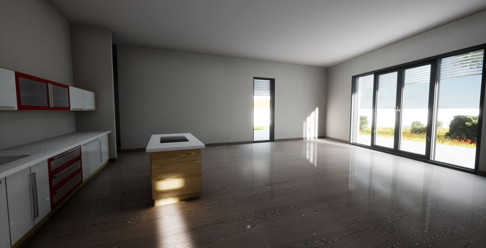
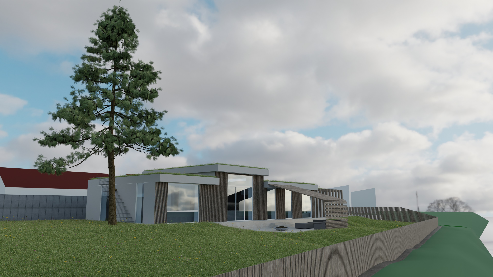

#### Interactive Architectural Visualization
* Real-time interactive demo software using Unreal Engine 4
* Hybrid lighting, using both real-time reflections and switchable dynamic lights, with pre-baked lightmaps

#### Realistic Architectural Visualization
* Realistic rendering
* Solar gain analysis 
* Quick and dirty mockup from on-site photos and measurements

#### *3D modelling and visual effects*
* visualizing and rendering various natural disasters
* distributed rendering locally on several machines
* physics simulation including fluids, smoke, collisions, and destruction

