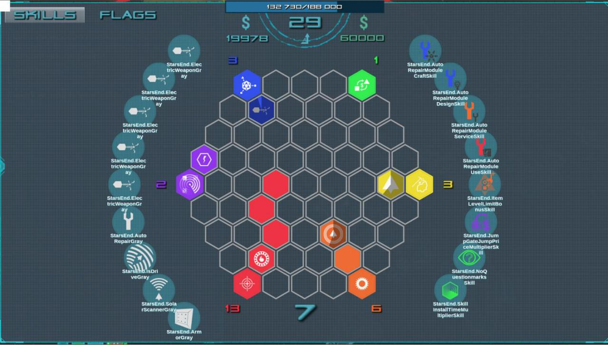
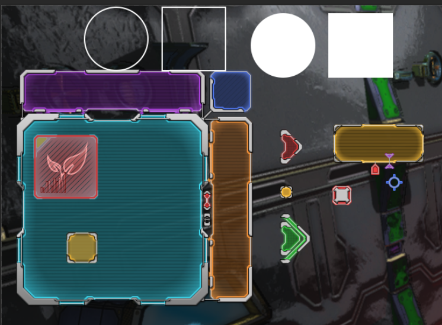
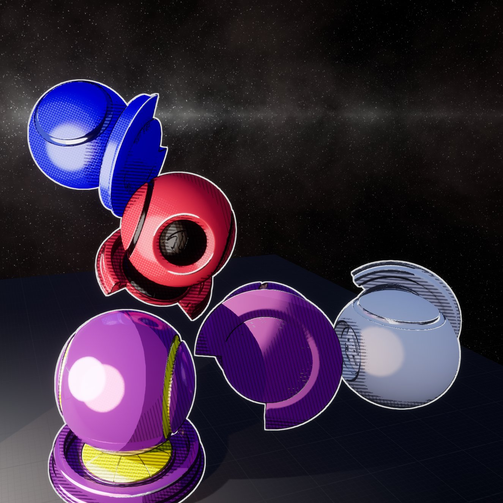
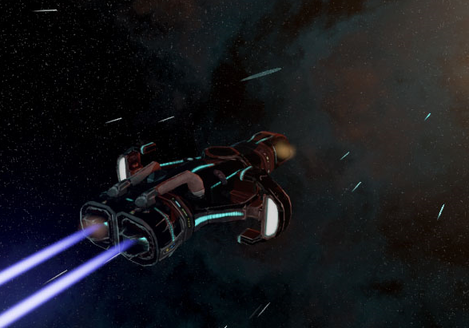

### *Stars End (MMORPG game software project)*

Led development and design of an ambitious multiplayer online game involving large-scale, space-themed gameplay. I handled virtually all aspects of game logic, engine customization (Unity 3D and Unreal Engine 4) from AI logic to shader programming. Built over 300 custom icons, volumetric effects, and modular 3D spaceship models, UI elements and a myriad of tools. The project required self-learning of various skills from writing the background lore to refining of business models, creation pipeline of assets, including all graphics both 2D and 3D, procedural geometry generation logic, VFX and sound design.

* Creative lead design
* Software design and development
  * Engine customization
    * Unity 3D
    * Unreal Engine 4
  * Architecture
  * Network communication
  * Data security
  * Scalability
* Gamedesign
  * Graphics design
    * Brand
    * 2D, 3D assets
    * UI/UX
    * VFX, shaders
    * AI, FSM
  * Sound and music
  * Level design
  * Story, missions and background info
* Development of content generation tools and additional software

