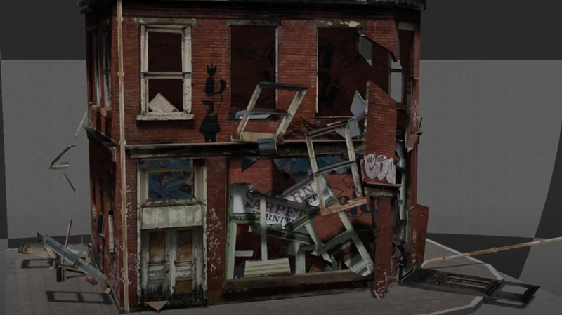
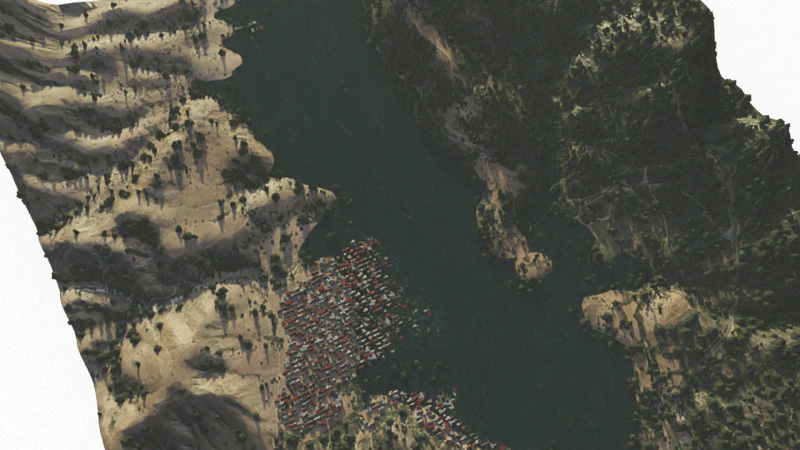
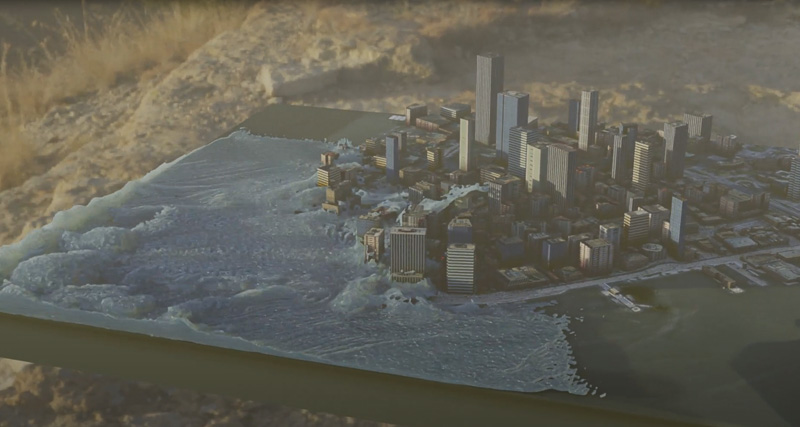

#### *3D modelling and visual effects*
* visualizing and rendering various natural disasters
* distributed rendering locally on several machines
* physics simulation including fluids, smoke, collisions, and destruction

